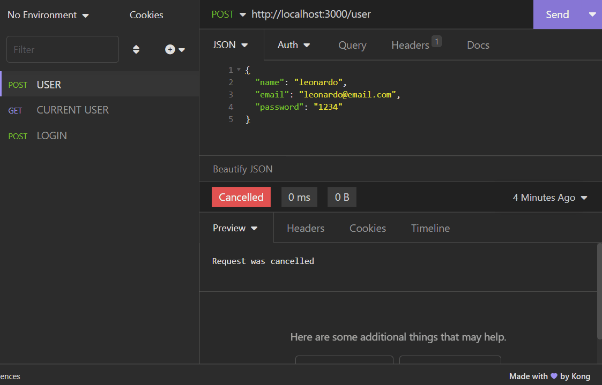

# Registration API

This is an API made with Node.js, Express.js and PostgreSQL.

## Description

API developed with the purpose of implementing registration and authentication using JSON Web Token(JWT). The User entity might be thought as an employee or admin of a company. In order to test the API, you can download [Insomnia](https://insomnia.rest/download) or [Postman](https://www.postman.com/). See demo below.

## Demo

To see the demo in higher quality click on the gif below.

## Run

Run npm install to install all dependencies 
Create a .env file with the following variables: 

- POSTGRES_HOST=your postgres host number
- POSTGRES_PORT=your postgres port number
- POSTGRES_USER=your postgres username
- POSTGRES_PASSWORD=your postgres password
- POSTGRES_DATABASE=your postgres database name
- JWT_SECRET=a jwt secret you can create

Run npm run dev to start the server
